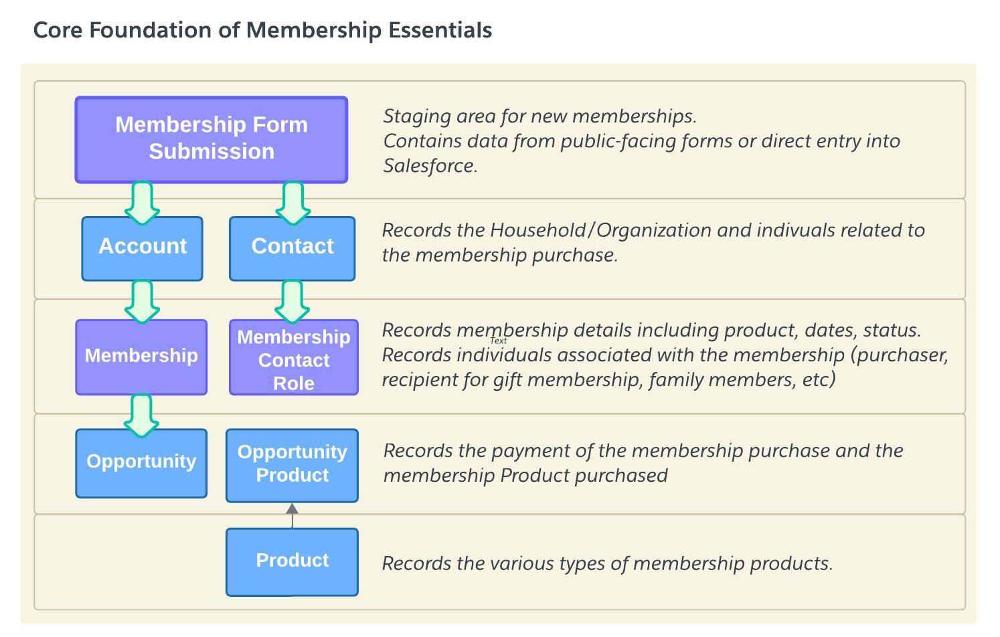

## What is Membership Essentials?

Membership Essentials is a flexible, sustainable open source community membership app that serves a broad variety of needs for organizations offering memberships. Membership Essentials supports paid and free memberships, offered to individuals, groups, and guests alongside donations which often accompany membership purchases.

The solution will include the full life cycle of the membership: registration, payment tracking, confirmation, renewals, reporting and web faced exposure. This solution is compatible with Salesforce Data Architectures including NPSP. (NPC compatibility testing is in process!)

Membership Essentials extends standard Salesforce objects with additional custom objects for tracking memberships and individuals/organizations tied to the membership. By decoupling the membership from an Opportunity, organizations can better manage their members, memberships and membership programs.

{:width="500"}

## Why Membership Essentials
Managing memberships effectively in Salesforce has been a challenge since memberships may be managed differently across different types of organizations.

The goal of the Membership Essentials project is to build a common data model and supporting automations for managing memberships in Salesforce. The package is intended to support everything from museums and alumni associations to sustaining donor programs and community gardens. The following questions were used as a guide for this project:

   * **What is the big problem that this project is trying to solve?**   The existing NPSP membership data model is very lightweight and doesn't meet many organizations’ needs. We seek to design a data model that is flexible and extensible for a wide range of membership and entitlement models including memberships and sponsorships.

   * **Who will be using this project?**   Organizations that have any form of membership or sponsorship, paid or unpaid.

   * **A year from now, how will people describe your project?**   A foundational data structure that can be extended and modified to meet organizational needs.

<footer>
   <a href="https://github.com/SFDO-Community-Sprints/MembershipSchemaAndBenefits-Documentation/edit/main/home-page.md" style="font-size: smaller;">Edit this page on GitHub.</a>
</footer>
